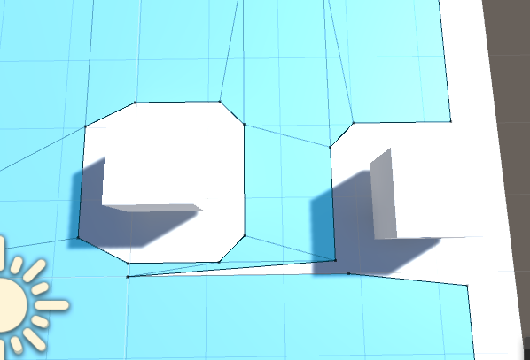

# What is this?
This is a project to reproduce a bug in Unity to do with a break in the navmesh when there are objects close to a tile boundary.

This project contains a single scene file with a plane and some cubes arranged to demonstrate the break.

This was tested on 5.6.0p2 and 2017.1.0f3; the break is present in both versions.

# Repro steps
- Place an object so that the edge of the area it cuts into the navmesh runs along a tile boundary
- Place other objects nearby, generally also on the tile boundary.
- Bake the navmesh, or do this whole process in code - the results are the same.

# Expected behaviour?
I would expect the generated navmesh to represent the navigable area around the placed objects

# Actual behaviour
The generated navmesh has a large 'tear' in it along the tile boundary, sometimes resulting in characters taking odd-looking detours, but sometimes resulting in areas being completely inaccessible

